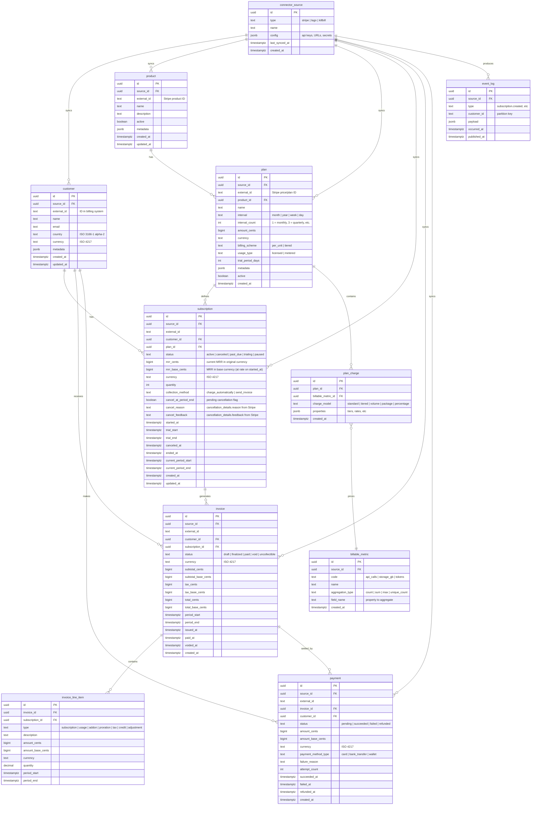

# Database

> Core schema, ER diagram, and rationale for PostgreSQL.
> Last updated: March 2026

## Why PostgreSQL (not ClickHouse)

ClickHouse excels at columnar analytics over billions of rows. But subscription analytics has different characteristics:

| Factor | Subscription Analytics | Implication |
|--------|----------------------|-------------|
| Data volume | Thousands-low millions of rows | PostgreSQL handles this comfortably |
| Write pattern | Frequent upserts from event processing | PostgreSQL's MVCC handles upserts natively; ClickHouse has eventual consistency with ReplacingMergeTree |
| Relationships | Deep: customer -> subscription -> invoice -> line items -> payments | PostgreSQL enforces referential integrity; ClickHouse has no foreign keys |
| Query pattern | JOINs across 4-5 tables for metric computation | PostgreSQL's query planner is built for this; ClickHouse JOINs are limited |
| Deployment | Self-hosted simplicity matters | PostgreSQL is the most widely deployed database; ClickHouse needs more operational expertise |

**Decision:** PostgreSQL as the single database. If a user later needs to feed a data warehouse, the metrics package can export to any target.

## Schema Ownership

The database has two categories of tables:

1. **Core tables** — managed by the framework. Store current state of billing entities and the event log. Defined below.
2. **Metric tables** — each [metric](metrics.md) owns its own tables (prefixed `metric_`). Created by the metric's `register_tables()` method. See individual metric docs in [Metrics](metrics.md).

This separation means adding a new metric never touches core schema.

## Entity-Relationship Diagram (Core Tables)



## FX Rates

The `fx_rate` table stores official daily exchange rates used to populate `*_base_cents` columns at ingest time. See [Money Handling](#money-handling) below.

## Expense Tables

Platform-neutral expense schema populated by `ExpenseConnector` subclasses (today: QuickBooks Online; future: Xero, FreshBooks, Wave, Sage). All tables follow the standard `(source_id, external_id)` uniqueness convention and the dual `*_cents` / `*_base_cents` money pattern. Connector-specific values live in `metadata_` JSON; cross-cutting tagging dimensions (project / class / department) live in `*_line.dimensions` JSON. Full design rationale: [expenses.md](expenses.md).

| Table | Purpose | Key columns |
|---|---|---|
| `vendor` | Counterparty (supplier) — mirror of `customer` | `external_id, name, email, country, currency, active, metadata_` |
| `account` | Chart of accounts (hierarchical via `parent_external_id`) | `external_id, name, account_type` (canonical), `account_subtype, parent_external_id, currency, active, metadata_` |
| `bill` | Accrual-side payable (A/P) | `external_id, vendor_id, status` (canonical), `doc_number, currency, subtotal_cents, tax_cents, total_cents` (+ `*_base_cents`), `txn_date, due_date, paid_at, voided_at, memo, metadata_` |
| `bill_line` | Line item on a bill | `bill_id, account_id, description, quantity, amount_cents, amount_base_cents, currency, dimensions` |
| `expense` | Direct cash/credit/check expense (no A/P) | `external_id, vendor_id, payment_type` (canonical), `doc_number, currency, subtotal_cents, tax_cents, total_cents` (+ `*_base_cents`), `txn_date, voided_at, memo, metadata_` |
| `expense_line` | Line item on an expense | `expense_id, account_id, description, quantity, amount_cents, amount_base_cents, currency, dimensions` |
| `bill_payment` | Payment applied to one or more bills | `external_id, bill_id, paid_at, amount_cents, amount_base_cents, currency, metadata_` |

Canonical enums (see [expenses.md](expenses.md#canonical-enums)):
- `account.account_type` ∈ `{expense, cogs, income, asset, liability, equity, other}`
- `bill.status` ∈ `{open, partial, paid, voided}`
- `expense.payment_type` ∈ `{cash, credit_card, check, bank_transfer, other}`

## Metric Tables

Each metric creates its own tables, prefixed with `metric_`. Monetary columns in metric tables follow the same dual-column convention (`*_cents` + `*_base_cents`). These are documented in [Metrics](metrics.md). Summary:

| Metric | Tables | Purpose |
|--------|--------|---------|
| MRR | `metric_mrr_snapshot`, `metric_mrr_movement` | Current MRR per subscription, MRR change log |
| Churn | `metric_churn_customer_state`, `metric_churn_event` | Customer activity tracking, churn events |
| Retention | `metric_retention_cohort`, `metric_retention_activity` | Cohort membership, monthly activity |
| LTV | `metric_ltv_customer_revenue` | Cumulative revenue per customer |
| Trials | `metric_trial`, `metric_trial_event` | Per-trial outcome (cohort queries); append-only lifecycle log |
| Expenses | (none — reads `bill_line` / `expense_line`) | Total expense by account type / vendor / period |

## Segments & Attributes

Workspace-scoped tables powering the [segmentation layer](segments.md). Shared with the dashboard/chart tables in `models_auth.py` so the application schema stays in one SQLAlchemy `metadata`.

| Table | Purpose |
|-------|---------|
| `attribute_definition` | Schema registry — `key`, `label`, `type` (`string | number | boolean | timestamp`), `source` (`stripe | csv | api | computed`) |
| `customer_attribute` | EAV value rows — one per `(source_id, customer_id, key)`. Only the `value_*` column matching the declared type is populated. Index `(key, source_id, customer_id)` matches the typical segment read pattern (filter attribute first, then intersect to customers) |
| `segment` | Saved segment definitions — JSON `SegmentDef` stored in `definition`, `created_by` captures auditing (workspace-shared — no per-user filter) |

## Event Log

The `event_log` table is a permanent archive of all [internal events](events.md). It serves two purposes:

1. **Replay source** — when Kafka retention expires or when bootstrapping a new deployment
2. **Audit trail** — full history of every billing system change

Events are append-only. The table is never updated or deleted from.

## Indexes

Key indexes beyond primary keys:

```sql
-- Unique billing system IDs
CREATE UNIQUE INDEX ix_customer_source ON customer(source_id, external_id);
CREATE UNIQUE INDEX ix_subscription_source ON subscription(source_id, external_id);
CREATE UNIQUE INDEX ix_invoice_source ON invoice(source_id, external_id);
CREATE UNIQUE INDEX ix_payment_source ON payment(source_id, external_id);

-- Event log queries
CREATE INDEX ix_event_log_type_time ON event_log(type, occurred_at);
CREATE INDEX ix_event_log_customer ON event_log(customer_id, occurred_at);

-- State queries
CREATE INDEX ix_subscription_status ON subscription(status, customer_id);
CREATE INDEX ix_invoice_period ON invoice(period_start, period_end, status);
CREATE INDEX ix_payment_status ON payment(status, created_at);

-- Cohort queries
CREATE INDEX ix_customer_created ON customer(created_at);
```

## Deployment Topologies

The database architecture depends on which [connector mode](connectors.md) is used.

### Separate Database (Stripe) — Primary

```
┌─────────────────┐     ┌─────────────────┐
│  Kafka/Redpanda │     │   PostgreSQL     │
│  (event bus)    │────►│  (analytics)     │
│                 │     │                  │
└─────────────────┘     │  core tables     │
                        │  metric_* tables │
                        └─────────────────┘
```

For Stripe (and any webhook-based connector), the analytics engine owns its own PostgreSQL and Kafka/Redpanda. Webhooks are ingested through Kafka, processed into core tables and metric tables. This is the primary deployment topology.

### Same-Database (Lago/Kill Bill) — Alternative

```
┌─────────────────────────────────────────────┐
│              PostgreSQL                      │
│                                             │
│  ┌─────────────────┐  ┌──────────────────┐  │
│  │ Lago/Kill Bill   │  │ Analytics        │  │
│  │ tables           │  │ metric_* tables  │  │
│  │ (billing-owned)  │  │ (analytics-owned)│  │
│  └─────────────────┘  └──────────────────┘  │
│                                             │
│  Billing engine and analytics share the     │
│  same PostgreSQL instance. Analytics        │
│  reads billing tables, writes metric_*.     │
└─────────────────────────────────────────────┘
```

For open-source billing engines (Lago, Kill Bill) that expose their PostgreSQL, the analytics engine can create its `metric_*` tables in a separate schema within the same database. No Kafka, no data copying, no sync lag.

**Alternative:** analytics connects to Lago's PostgreSQL as read-only and maintains its own PostgreSQL for `metric_*` tables. More isolation, slightly more operational complexity.

### Lago Schema References

When using same-database mode with Lago, the analytics engine queries these Lago-owned tables (read-only):

| Lago Table | Key Columns | Analytics Use |
|-----------|-------------|---------------|
| `subscriptions` | `id`, `customer_id`, `plan_id`, `status`, `started_at`, `terminated_at` | Active subscription state |
| `fees` | `subscription_id`, `amount_cents`, `fee_type`, `created_at` | MRR source of truth (fee-type separation) |
| `invoices` | `id`, `customer_id`, `status`, `total_amount_cents` | Revenue tracking |
| `customers` | `id`, `external_id`, `name`, `email` | Customer records |
| `plans` | `id`, `name`, `interval`, `amount_cents` | Plan definitions |
| `charges` | `id`, `plan_id`, `charge_model`, `properties` | Usage-based pricing |

The analytics engine never writes to Lago tables.

## Money Handling

### Dual-Column Convention

Every monetary column is stored twice:

1. **Original currency** (`*_cents BIGINT`, `currency TEXT`) — exact value from the billing system, no rounding
2. **Base-currency equivalent** (`*_base_cents BIGINT`) — converted at the official daily FX rate on the date the amount was recorded

```sql
-- Example: invoice totals
total_cents       BIGINT NOT NULL,   -- e.g. 4999 (EUR)
currency          TEXT NOT NULL,     -- 'EUR'
total_base_cents   BIGINT NOT NULL,   -- e.g. 5399 (base currency at that day's rate)
```

This allows:
- **Exact per-customer records** in original currency (for invoices, statements)
- **Fast cross-currency aggregations** in base currency without joining the FX rate table at query time

If the transaction currency matches the configured base currency, both columns hold the same value.

### FX Rates Table

```sql
CREATE TABLE fx_rate (
    id           UUID PRIMARY KEY DEFAULT gen_random_uuid(),
    date         DATE NOT NULL,
    from_currency TEXT NOT NULL,   -- ISO 4217, e.g. 'EUR'
    to_currency   TEXT NOT NULL,   -- matches BASE_CURRENCY (e.g. 'USD', 'EUR')
    rate          NUMERIC(18, 8) NOT NULL,  -- e.g. 1 EUR = 1.0798 USD
    source        TEXT NOT NULL,   -- 'ecb' | 'openexchangerates' | 'manual'
    UNIQUE(date, from_currency, to_currency)
);

CREATE INDEX ix_fx_rate_lookup ON fx_rate(from_currency, to_currency, date DESC);
```

Rates are fetched once daily (e.g., from ECB or Open Exchange Rates) and stored here. The analytics engine uses `fx_rate` to populate `*_base_cents` when ingesting events or polling Lago.

### Base-Currency Conversion at Ingest Time

The base currency is set once at deployment via the `BASE_CURRENCY` environment variable (default: `USD`). All `*_base_cents` columns are converted to this currency at ingest time.

Database access is always async via SQLAlchemy's `AsyncSession` / `AsyncEngine`. The FX lookup follows the same pattern:

```python
async def to_base_cents(amount_cents: int, currency: str, on_date: date,
                        db: AsyncSession, base_currency: str = "USD") -> int:
    if currency == base_currency:
        return amount_cents
    result = await db.execute(
        text("SELECT rate FROM fx_rate WHERE from_currency = :c AND to_currency = :base"
             " AND date <= :d ORDER BY date DESC LIMIT 1"),
        {"c": currency, "base": base_currency, "d": on_date}
    )
    rate = result.scalar()
    if rate is None:
        raise ValueError(f"No FX rate for {currency}/{base_currency} on or before {on_date}")
    return int(amount_cents * rate)
```

### Aggregation Pattern

Use `*_base_cents` for totals (MRR, ARR, revenue) and `currency` + `*_cents` for per-customer display:

```sql
-- Fast: no runtime FX join needed
SELECT SUM(mrr_base_cents) / 100.0 AS mrr
FROM metric_mrr_snapshot
WHERE mrr_base_cents > 0;

-- Per-customer breakdown in original currency
SELECT customer_id, currency, SUM(mrr_cents) / 100.0 AS mrr
FROM metric_mrr_snapshot
WHERE mrr_cents > 0
GROUP BY customer_id, currency;
```

### Notes

- `mrr_cents = 4999` in EUR, `mrr_base_cents = 5399` means 53.99/month in base currency at that day's rate
- Annual plan at 599/year: `mrr_cents = 59900 / 12 = 4991` (integer division, rounds down)
- Historical base-currency values are frozen at the rate on the date of the event — they do not retroactively update when FX rates change
- The base currency is set once at deployment time via `BASE_CURRENCY` and should not be changed after data has been ingested
